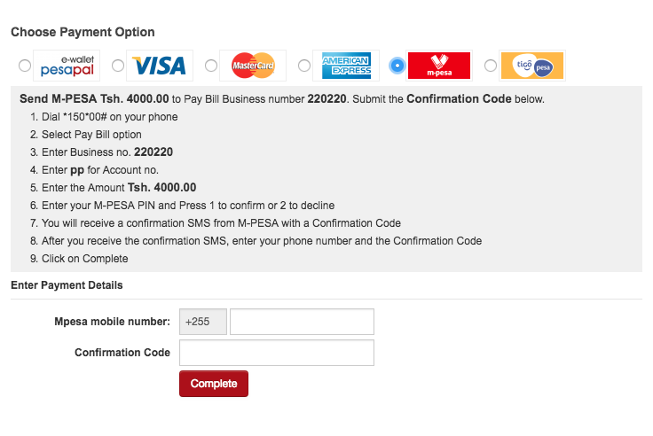
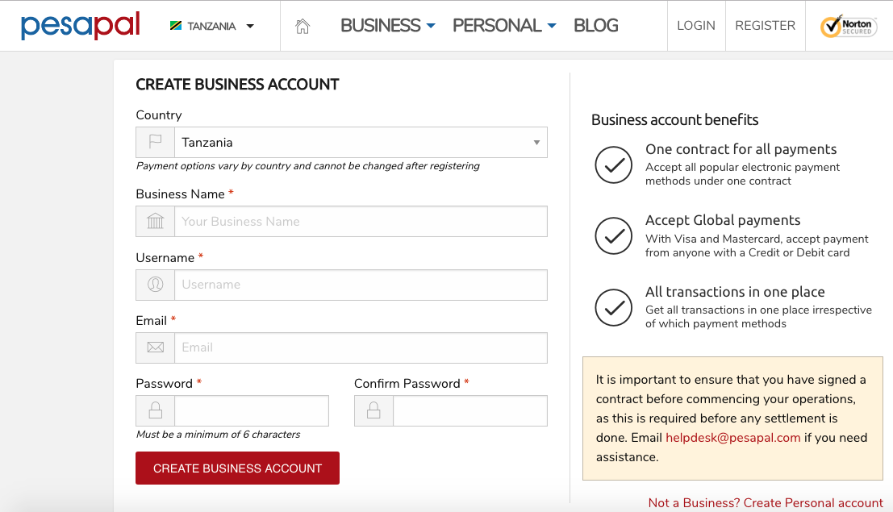

# Pesapal package for Laravel apps  

[](https://github.com/bryceandy/laravel_pesapal/actions) 
<a href="https://packagist.org/packages/bryceandy/laravel_pesapal"></a>
<a href="https://packagist.org/packages/bryceandy/laravel_pesapal"></a>
<a href="https://packagist.org/packages/bryceandy/laravel_pesapal"></a>  

  

This package enables Laravel developers to easily make use of the [Pesapal](https://www.pesapal.com) API. There are M-Pesa, Tigo pesa payments popular with East African mobile money systems. Other payment integrations include, but not limited to: 

  - Mastercard
  - Visa
  - American Express

### Version support  

| Laravel version | Package version | Maintenance |
| --- | --- | --- |
| 5.7 - 6 | 1.0.0 - 1.0.1 | No longer maintained |
| 7 and above | 2.0.0 | Actively maintained |

### Installation

Pre-installation requirements

  - A running  or newly installed Laravel 7.* or above
  - PHP 7.4 or above
  - cURL extension installed

Now run the command...

```sh
$ composer require bryceandy/laravel_pesapal
```

### Files and Configuration

After it has finished downloading the files, inside your config/app.php file add the following line in the providers array

```php
'providers' => [
        /*
         * Application Service Providers...
         */
        Bryceandy\Laravel_Pesapal\PesapalServiceProvider::class,
    ]
```

Next we publish the files onto our project using the command

```sh
$ php artisan vendor:publish --provider="Bryceandy\Laravel_Pesapal\PesapalServiceProvider"
```

After it runs successfully, you must see the following:

  - A controller ```TransactionController.php``` inside 'app/Http/Controllers'
  - A new model ```app/Transaction.php```
  - A migration to create the Transactions table under 'database/migrations/'. In order for this to work according to the setup, your Users table needs to have at least ```first_name```, ```last_name```, ```email``` fields, also password in the migrations set to ```nullable()```. Lastly in the Users model, add the previous 3 fields inside the ```$fillable``` array, but since you have all these migrations and models you can modify them per your needs.
  - New routes listed under 'resources/views/pesapal'. The views available are ```details.blade.php```, ```iframe.blade.php``` and ```callback_example.blade.php```
  - A configuration file 'config/pesapal.php' and lastly
  - A pesapal directory in the root 'public/' which should not be modified.
  
Now after modifying the models, migrations and controller if need be then it is necessary to migrate normally using 

```bash
$ php artisan migrate
```

#### Routes
 
##### N B: You are not supposed to create any of these roots as they are configured for you.

  - The `details.blade.php` view will display payment details where the user will put their details. Its route is a GET request to yourSite.com/details

  - The `iframe.blade.php` view will display payment options as seen in the first image above. Its route is a POST request to yourSite.com/iframe

  - The `callback_example.blade.php` is the view your users will land to after making a payment, it will also show the payment status for every transaction. Its route is a GET request to yourSite.com/callback

Head over to [demo](https://demo.pesapal.com) if you want a testing environment or [live](https://www.pesapal.com) for a live integration and create a business account. You will obtain a key-secret pair for your integration



#### Setting configs

Head over your project and create environment variables inside your ```.env``` such as
```dotenv
PESPAL_KEY='yourConsumerKey'
PESAPAL_SECRET='yourConsumerSecret'
```

###### IMPORTANT

Especially for live accounts, on your pesapal dashboard find your Account Settings and click IPN Settings. Fill in your website domain i.e ```yourWebsite.co.tz``` and IPN listener URL as ```yourWebsite.co.tz/pesapal/ipn.php```, whatever your website name is just add '/pesapal/ipn.php' infront of it.

Lastly modify config/pesapal.php and set true if you have a live account, false if otherwise. Add your callback URL, dont touch the consumer key or secret and lastly write the email you wish to receive IPN notifications.

**Go ahead and start making payments!** Visit **YourSite'sDomain/details**


i.e localhost/details or myAwesomeWebsite.com/details

License
----

MIT

## Contributors
The original content of the API as obtained from [Pesapal](http://developer.pesapal.com/how-to-integrate/php-sample)
  - [BryceAndy](http://bryceandy.com) > hello@bryceandy.com
  - Feel free to create pull requests and contribute on this package

**Free Software, Hell Yeah!**